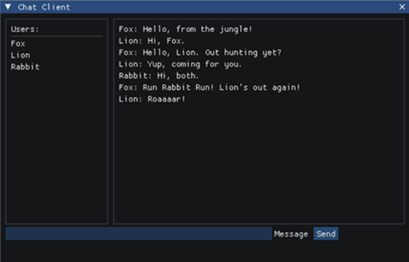
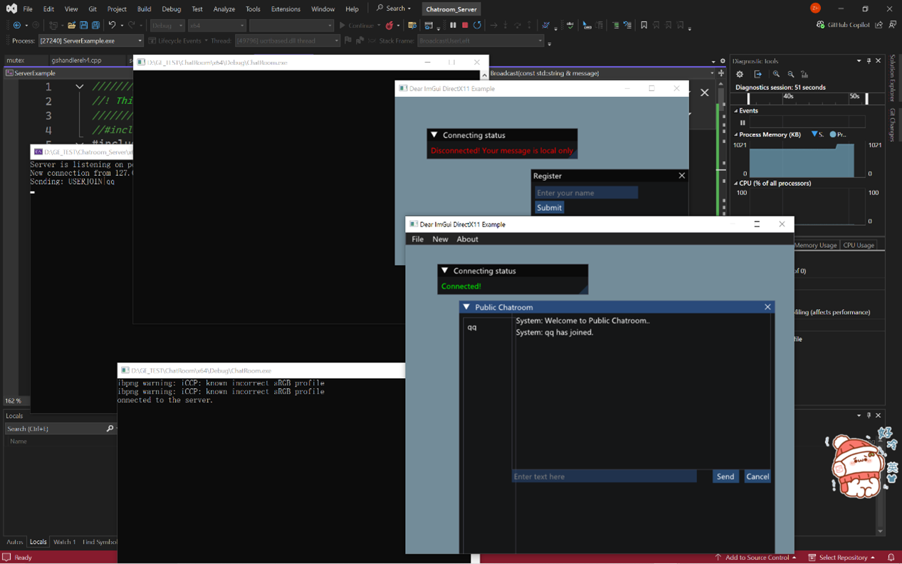
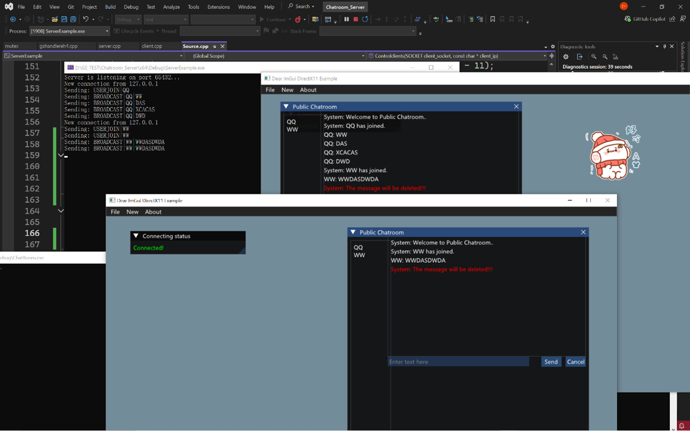

# 简单的多线程聊天室(客户端)
基于C++与winsock构建的多线程TCP聊天服务器客户端,用于学习基本的网络通信, 客户端管理与消息通信等知识, 通过TCP与服务器进行交互, 使用Imgui渲染用户界面

## 功能
- **服务器状态检测**: 基于Imgui窗口, 实时显示服务器状态
- **用户注册**: 启动后弹出注册窗口,填写名字可以进入聊天室,名字会在服务器列表实时更新
- **ImGui构建的UI界面**: 基于Imgui构建的UI界面
- **基于FMOD的通知系统**: 用户加入或者离开客户端会收到FMOD控制播放的消息通知音
- **用户列表同步**: 服务器随时记录并更新当前用户
- **垃圾回收**: 实时检测消息数量, 接近临界数量时,清空消息释放内存
## 消息协议
- BROADCAST|<message> — 向所有用户发送公开消息。


## 技术栈
- C++14
- C++多线程
- Winsock
- ImGui
- FMOD

## 部分展示





## 部分结构示例:
```cpp
namespace MyUI {
    Network net;                     // 全局网络实例
    std::mutex messageMutex;         // 网络消息线程互斥
    class ChatMessage;               // 聊天消息封装类
    class ChatBox;                   // 公共聊天框
   
    
    void RenderUI(Audio& sfxSys);    // 主 UI 渲染函数
    void SendMessages(...);          // 发送公共消息

}

```

# English:
# Simple Multithreaded Chatroom (Client)
A multithreaded TCP chat server client built with C++ and Winsock, designed for learning the fundamentals of network communication, client management, and message exchange. It communicates with the server via TCP and uses ImGui to render the user interface.

## Features
- **Server Status Monitoring**: Displays real-time server status through an ImGui window
- **User Registration**: A registration window pops up on launch; users can enter a name to join the chatroom. Names are updated in real time on the server list
- **UI Built with ImGui**: The entire interface is constructed using ImGui
- **Notification System via FMOD**: Users receive FMOD-driven audio notifications when someone joins or leaves the chatroom
- **User List Synchronization**: The server continuously records and updates the current users
- **Garbage Collection**: Monitors the number of messages in real-time and clears them to free memory when approaching the threshold

## Message Protocol
- BROADCAST|<message> — Sends a public message to all users.

## Tech Stack
- C++14
- C++ Multithreading
- Winsock
- ImGui
- FMOD

## Showcase
  
  
  


## Code Structure Example:
```cpp
namespace MyUI {
    Network net;                     // Global network instance
    std::mutex messageMutex;         // Mutex for network message thread
    class ChatMessage;               // Chat message encapsulation class
    class ChatBox;                   // Public chat box
   
    void RenderUI(Audio& sfxSys);    // Main UI rendering function
    void SendMessages(...);          // Send public messages
}
